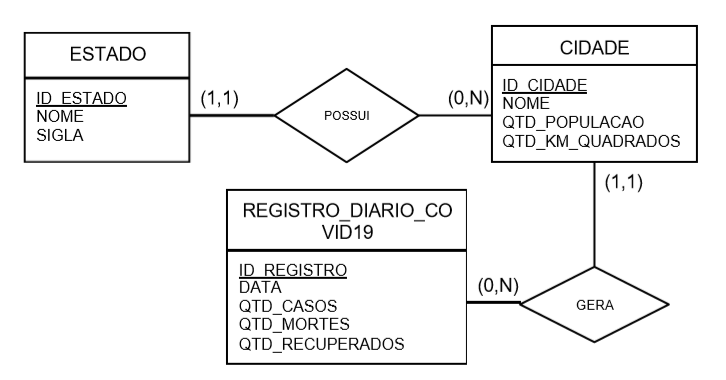

## Motivação

Pensando na construção um sistema de informações para auxiliar na tomada de decisões para gestores públicos e agentes de saúde,
vamos elaborar um banco de dados para registrar o avanço do COVID-19 pelo Brasil. 
Para isso, a tabela REGISTRO_DIARIO_COVID19 irá armazenar o número de pessoas infectadas, à óbito e curadas de um determinado dia e cidade.

### 1ª Etapa Criação da Estrutura



Algumas dicas importantes:

● A chave primária das tabelas podem ser auto incrementadas pelo SGBD;

● Os atributos com prefixo QTD_ devem ser, obrigatoriamente, do tipo INTEGER;

● O atributo chamado DATA deve ser do tipo DATE.

### 2.Etapa) Criação dos Dados 

● 10 estados. Obrigatório que esteja na lista: São Paulo, Rio de Janeiro e Amazonas;

● 20 cidades (relacionado entre os estados). Obrigatório que esteja na lista: São Paulo, Rio de
Janeiro e Manaus;

● 60 registros diários de COVID, para diferentes dias e cidades. Mantenha algumas cidades sem registros (pelo menos duas).
Dica: Para informar um valor válido para o campo DATA, utilize a seguinte sintaxe no MySQL: AAAA-MM-DD. 

Exemplo:
```
INSERT INTO EXEMPLO(DATA) VALUES ('2020- 05 - 22');
```

### 3ª Etapa Consultas


1. Retornar o nome das cidades de um determinado estado, ordenado pela quantidade da
    população;
2. Retornar o nome dos estados que comecem com a letra S:
3. Informar quando houve o início da doença, ou seja, a data mais antiga registrada na tabela
    REGISTRO_DIARIO_COVID19:
4. Listar o nome da cidade e a sigla do estado cujo tamanho do município seja maior que 1000
    quilômetros quadrados:
5. Retornar a soma da quantidade de casos de uma determinada cidade:
6. Retornar a soma de óbitos ocorridos desde ontem para o estado de São Paulo:
7. Listar a data, a quantidade de casos e a quantidade de óbitos do estado do Rio de Janeiro a partir
    do dia 1º de maio, ordenando pela data:
8. Listar as cidades que ainda não possuem nenhum registro de COVID-19:
9. Informar a soma da quantidade de pessoas atualmente enfermas na cidade de Manaus. Para isso,
    utilize o cálculo: QTD_CASOS - QTD_OBITOS - QTD_RECUPERADOS:
10. Liste o nome da cidade e a taxa de mortalidade, obtida a partir do seguinte cálculo: QTD_OBITOS
    / QTD_CASOS * 100:
11. Informe o nome da cidade, a quantidade da população e a porcentagem no número de infectados
    do município que possui mais casos confirmados. Para calcular a porcentagem, utilize o seguinte
    cálculo: QTD_CASOS / QTD_POPULACAO * 100:
    
## Código .sql
    
 ```
    CREATE DATABASE COVID;
USE COVID;

/*
PRIMEIRA ETAPA
*/

CREATE TABLE ESTADO(ID_ESTADO INT NOT NULL AUTO_INCREMENT PRIMARY KEY
					,NOME VARCHAR(200) NOT NULL
                    ,SIGLA VARCHAR(50) NOT NULL);
                    
CREATE TABLE CIDADE (ID_CIDADE INT NOT NULL AUTO_INCREMENT PRIMARY KEY
					,NOME VARCHAR(200) NOT NULL
                    ,QTD_POPULACAO INTEGER NULL
                    ,QTD_KM_QUADRADOS INTEGER NULL
                    ,ID_ESTADO INT NOT NULL
                    ,FOREIGN KEY (ID_ESTADO) REFERENCES ESTADO(ID_ESTADO));
                    
CREATE TABLE REGISTRO_DIARIO_COVID19(ID_REGISTRO INT NOT NULL AUTO_INCREMENT PRIMARY KEY
									,DATA DATE NOT NULL
                                    ,QTD_CASOS INTEGER NULL
                                    ,QTD_MORTES INTEGER NULL
                                    ,QTD_RECUPERADOS INTEGER NULL
                                    ,ID_CIDADE INT NOT NULL
                                    ,FOREIGN KEY (ID_CIDADE) REFERENCES CIDADE(ID_CIDADE));
                                    
/*
SEGUNDA ETAPA
*/

INSERT INTO ESTADO (NOME, SIGLA) VALUES
('Acre', 'AC'),
('Alagoas', 'AL'),
('Amazonas', 'AM'),
('Amapá', 'AP'),
('Bahia', 'BA'),
('Ceará', 'CE'),
('Distrito Federal', 'DF'),
('Espírito Santo', 'ES'),
('Goiás', 'GO'),
('Maranhão', 'MA'),
('Minas Gerais', 'MG'),
('Mato Grosso do Sul', 'MS'),
('Mato Grosso', 'MT'),
('Pará', 'PA'),
('Paraíba', 'PB'),
('Pernambuco', 'PE'),
('Piauí', 'PI'),
('Paraná', 'PR'),
('Rio de Janeiro', 'RJ'),
('Rio Grande do Norte', 'RN'),
('Rondônia', 'RO'),
('Roraima', 'RR'),
('Rio Grande do Sul', 'RS'),
('Santa Catarina', 'SC'),
('Sergipe', 'SE'),
('São Paulo', 'SP'),
('Tocantins', 'TO');      

INSERT INTO CIDADE (NOME, QTD_POPULACAO, QTD_KM_QUADRADOS, ID_ESTADO) VALUES     
('Porto Velho', 1100205, 34082, 21),
('Manaus', 2182763, 11401, 3),
('Rio Branco', 407319, 8834, 1),
('Campo Grande', 5002704, 8096, 12),
('Macapá', 1600303, 6407, 4),
('Brasília', 5300108, 5801, 7),
('Boa Vista', 1400100, 5687, 22),
('Cuiabá', 5103403, 3538, 13),
('Palmas', 1721000, 2218, 27),
('Teresina', 2211001, 1755, 17),
('São Paulo', 3550308, 1522, 26),
('Rio de Janeiro', 3304557, 1182, 19),
('Belém', 1501402, 1064, 14),
('São Luís', 2111300, 827, 10),
('Goiânia', 5208707, 739, 9),
('Salvador', 2927408, 692, 5),
('Maceió', 2704302, 510, 2),
('Porto Alegre', 4314902, 496, 23),
('Curitiba', 4106902, 434, 18),
('Florianópolis', 4205407, 433, 24),
('Belo Horizonte', 3106200, 313, 11),
('Fortaleza', 2304400, 313, 6),
('Recife', 2611606, 217, 16),
('João Pessoa', 2507507, 210, 15),
('Aracaju', 2800308, 174, 25),
('Natal', 2408102, 170, 20),
('Vitória', 3205309, 93, 8);

INSERT INTO registro_diario_covid19 (DATA, QTD_CASOS, QTD_MORTES, QTD_RECUPERADOS, ID_CIDADE) 
VALUES
('2020-06-01',6326,161,322,3),
('2020-06-01',10837,461,922,17),
('2020-06-01',41774,2071,4142,2),
('2020-06-01',18898,701,1402,16),
('2020-06-01',10510,171,342,6),
('2020-06-01',14069,614,1228,27),
('2020-06-01',3906,127,254,15),
('2020-06-01',35297,976,1952,14),
('2020-06-01',2541,66,132,8),
('2020-06-01',1568,20,40,4),
('2020-06-01',10670,278,556,21),
('2020-06-01',38046,2925,5850,13),
('2020-06-01',13695,370,740,24),
('2020-06-01',4835,190,380,19),
('2020-06-01',34900,2875,5750,23),
('2020-06-01',5119,168,336,10),
('2020-06-01',7964,323,646,12),
('2020-06-01',9332,232,464,26),
('2020-06-01',54530,5462,10924,18),
('2020-06-01',5172,159,318,1),
('2020-06-01',3692,116,232,7),
('2020-06-01',9498,146,292,20),
('2020-06-01',111296,7667,15334,11),
('2020-06-01',7233,166,332,25),
('2020-06-01',4345,76,152,9),
('2020-05-31',6219,148,296,3),
('2020-05-31',10288,443,886,17),
('2020-05-31',41378,2052,4104,2),
('2020-05-31',18392,667,1334,16),
('2020-05-31',9780,170,340,6),
('2020-05-31',13690,604,1208,27),
('2020-05-31',3702,124,248,15),
('2020-05-31',34639,955,1910,14),
('2020-05-31',2429,61,122,8),
('2020-05-31',1489,20,40,4),
('2020-05-31',10464,271,542,21),
('2020-05-31',37961,2923,5846,13),
('2020-05-31',13162,360,720,24),
('2020-05-31',4687,182,364,19),
('2020-05-31',34450,2807,5614,23),
('2020-05-31',4931,161,322,10),
('2020-05-31',8051,305,610,12),
('2020-05-31',9332,224,448,26),
('2020-05-31',53388,5344,10688,18),
('2020-05-31',4942,156,312,1),
('2020-05-31',3474,116,232,7),
('2020-05-31',9037,143,286,20),
('2020-05-31',109698,7615,15230,11),
('2020-05-31',6999,158,316,25),
('2020-05-31',4176,73,146,9),
('2020-05-30',107142,7532,15064,11),
('2020-05-29',101556,7275,14550,11),
('2020-05-28',95865,6980,13960,11),
('2020-05-26',89483,6712,13424,11),
('2020-05-25',79483,5712,11424,11),
('2020-05-24',69483,4712,9424,11),
('2020-05-23',59483,4112,8224,11),
('2020-05-22',49483,3912,7824,11),
('2020-05-21',39483,3821,7642,11),
('2020-05-20',29483,3800,7600,11);

/*
TERCEIRA ETAPA
*/

/* 1. Retornar o nome das cidades de um determinado estado, ordenado pela quantidade da
população;
 */
SELECT 		c.NOME 
FROM 		CIDADE c 
INNER JOIN 	ESTADO E on c.id_estado = e.id_estado 
where		e.sigla = 'SP'
order by qtd_populacao;

/*
2. Retornar o nome dos estados que comecem com a letra S:
*/
select 	nome from ESTADO WHERE nome like 's%';

/*
3. Informar quando houve o início da doença, ou seja, a data mais antiga registrada na tabela
REGISTRO_DIARIO_COVID19: 
*/

SELECT DATA FROM REGISTRO_DIARIO_COVID19 ORDER BY DATA ASC LIMIT 1;

/*
4. Listar o nome da cidade e a sigla do estado cujo tamanho do município seja maior que 1000
quilômetros quadrados:
*/

SELECT 		c.NOME
			,e.SIGLA 
FROM 		CIDADE c
INNER JOIN	ESTADO e on c.id_estado = e.id_estado
WHERE c.QTD_KM_QUADRADOS > 1000;

/*
5. Retornar a soma da quantidade de casos de uma determinada cidade:
*/

SELECT 	SUM(r.qtd_casos) as total 
FROM 		REGISTRO_DIARIO_COVID19 r 
INNER JOIN	CIDADE c on r.id_cidade = c.id_cidade
where		c.nome = 'São Paulo';

/*
6. Retornar a soma de óbitos ocorridos desde ontem para o estado de São Paulo:	
*/
SELECT 	SUM(r.qtd_mortes) AS total 
FROM 		REGISTRO_DIARIO_COVID19 r 
INNER JOIN	CIDADE c ON r.id_cidade = c.id_cidade
WHERE		c.nome = 'São Paulo'
AND			r.DATA  > '2020-05-21';

/*
7. Listar a data, a quantidade de casos e a quantidade de óbitos do estado do Rio de Janeiro a partir
do dia 1º de maio, ordenando pela data:
*/

SELECT 			r.DATA
				,r.QTD_CASOS
				,r.QTD_MORTES
FROM 			REGISTRO_DIARIO_COVID19 r 
INNER JOIN		CIDADE c on r.id_cidade = c.id_cidade
INNER JOIN		ESTADO e on e.id_estado = c.id_estado
WHERE			e.sigla = 'RJ'
AND				r.data > '2020-05-01'
ORDER BY 		r.data;

/*
8. Listar as cidades que ainda não possuem nenhum registro de COVID-19:
*/

SELECT 		* 
FROM 		CIDADE c
LEFT JOIN	REGISTRO_DIARIO_COVID19 r on r.id_cidade = c.id_cidade
WHERE		r.id_registro is null;

/*
9. Informar a soma da quantidade de pessoas atualmente enfermas na cidade de Manaus. Para isso,
utilize o cálculo: QTD_CASOS - QTD_OBITOS - QTD_RECUPERADOS:
	
*/

SELECT 			(SUM(r.QTD_CASOS) - SUM(QTD_MORTES)) - SUM(QTD_RECUPERADOS)				
FROM 			REGISTRO_DIARIO_COVID19 r 
INNER JOIN		CIDADE c on r.id_cidade = c.id_cidade
WHERE			c.NOME = 'Manaus';

/*
10. Liste o nome da cidade e a taxa de mortalidade, obtida a partir do seguinte cálculo: QTD_OBITOS
/ QTD_CASOS * 100:
*/

SELECT 		c.NOME
			,((r.QTD_MORTES / r.QTD_CASOS) * 100) AS TAXAMORTALIDADE
FROM 		CIDADE c 
INNER JOIN	REGISTRO_DIARIO_COVID19 r ON r.id_cidade = c.id_cidade;

/*
11. Informe o nome da cidade, a quantidade da população e a porcentagem no número de infectados
do município que possui mais casos confirmados. Para calcular a porcentagem, utilize o seguinte
cálculo: QTD_CASOS / QTD_POPULACAO * 100:	
*/

SELECT 		c.NOME
			,c.QTD_POPULACAO
			,((r.QTD_CASOS / c.QTD_POPULACAO) * 100) AS TAXAINFECTADOS			
FROM 		REGISTRO_DIARIO_COVID19 r 
INNER JOIN	CIDADE c on r.id_cidade = c.id_cidade
GROUP BY 	c.NOME, r.id_cidade, TAXAINFECTADOS
ORDER BY 	QTD_CASOS DESC 
LIMIT 1
```
